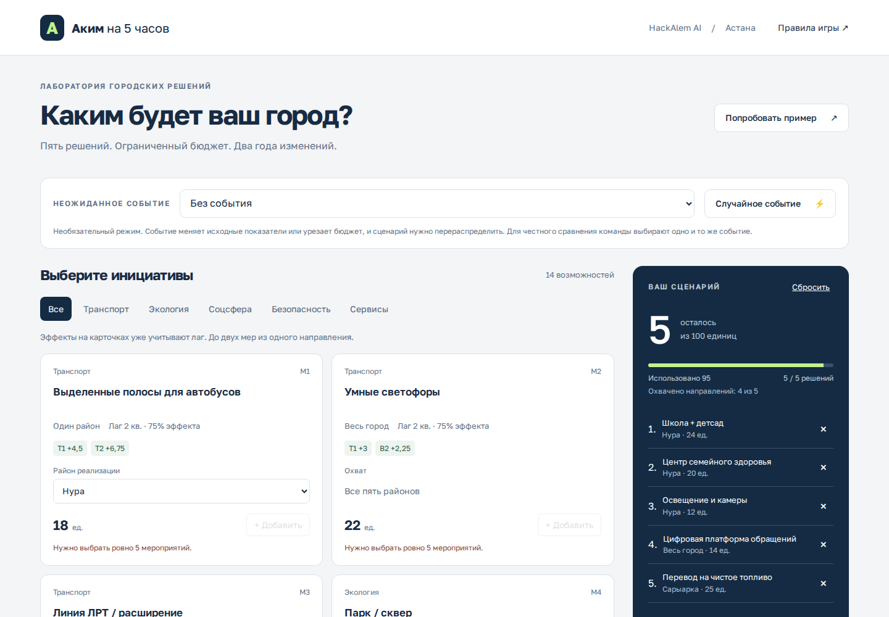
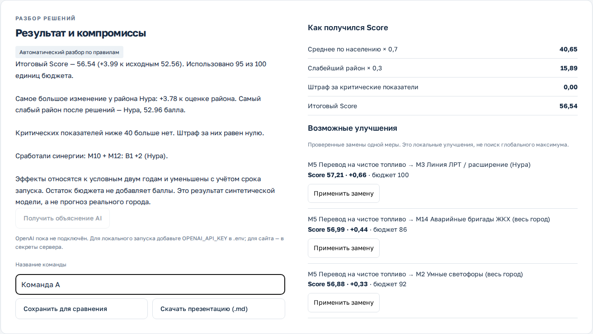
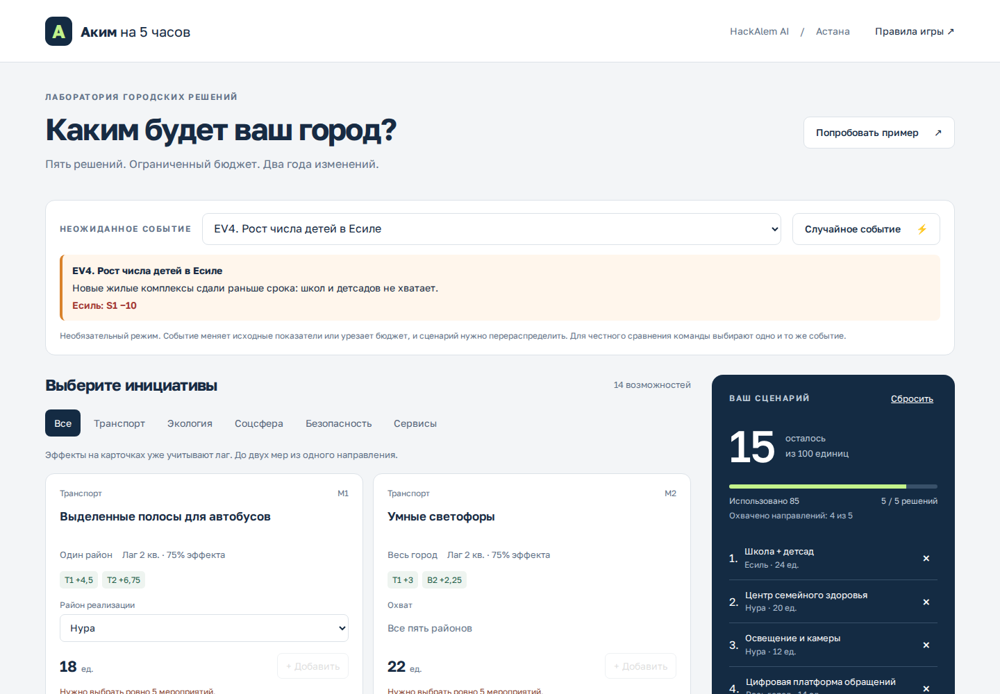
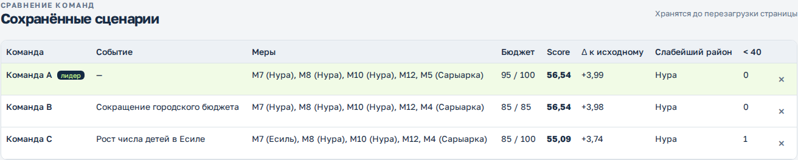
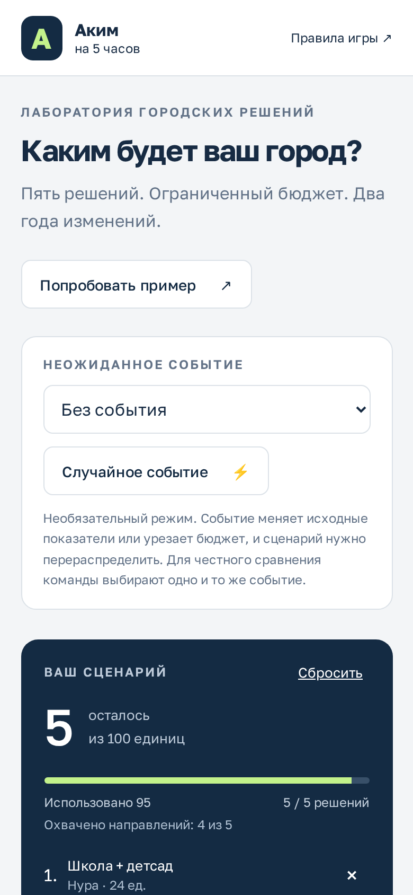

# Аким на 5 часов — AI-симулятор управления городом

Симулятор решений для пяти районов Астаны (задача HackAlem AI). Пользователь выбирает **ровно пять инициатив** в пределах **единого бюджета 100**. Детерминированная модель считает последствия на горизонте восьми кварталов и итоговый **Astana Quality of Life Score**. OpenAI объясняет уже проверенные расчёты: сильные стороны, риски и компромиссы. Сам он чисел не считает.



## Соответствие критериям задачи

| Требование                               | Где реализовано                                                                                                    |
| ---------------------------------------- | ------------------------------------------------------------------------------------------------------------------ |
| Единый бюджет и исходные данные для всех | `simulator/public/engine.mjs`: константы `BUDGET`, `districts`, `measures` из датасета организаторов               |
| Решения по 5 направлениям                | Каталог из 14 мер по направлениям транспорт, экология, соцсфера, безопасность, сервисы; счётчик охвата направлений |
| Автоматический контроль бюджета          | `validate()` в интерфейсе (кнопка блокируется с причиной) и повторно на сервере в `api.mjs`                        |
| Решения влияют на показатели             | Лаги, синергии, клиппинг 0–100, штраф за значения ниже 40; покрыто тестами                                         |
| AI-анализ и объяснение компромиссов      | `POST /api/analyze` → OpenAI Responses API; без ключа — детерминированный разбор по правилам                       |
| Разные решения → разный Score            | Детерминированный пересчёт; порядок решений не важен (тест)                                                        |
| _Опц._ Сравнение команд                  | Таблица «Сравнение команд» с отметкой лидера                                                                       |
| _Опц._ Визуализация изменений районов    | Карточки районов и матрица 5 × 10 с изменениями к базе                                                             |
| _Опц._ Рекомендации по улучшению         | Проверенные замены одной меры, применяются в один клик                                                             |
| _Опц._ Неожиданные городские события     | 5 событий: удар по показателям или сокращение бюджета, требующее перераспределения                                 |
| _Опц._ Автогенерация краткой презентации | Кнопка «Скачать презентацию (.md)» — Marp-совместимые слайды из рассчитанных фактов                                |

## Быстрый запуск

Нужен Node.js 22 или новее. Внешних зависимостей нет, `npm install` не требуется.

```sh
cd simulator
npm start          # то же, что: node --env-file-if-exists=.env server.mjs
```

Откройте http://localhost:5173. Без ключа OpenAI работают расчёты, проверка ограничений, события, сравнение, презентация и автоматический разбор по правилам.

## Подключение AI

1. Скопируйте `simulator/.env.example` в `simulator/.env`.
2. Укажите `OPENAI_API_KEY` и при необходимости доступную вашему проекту модель в `OPENAI_MODEL` (по умолчанию `gpt-5`).
3. Перезапустите сервер. Кнопка «Получить объяснение AI» станет активной.

Ключ хранится только на сервере, `.env` исключён из Git. Запрос использует [OpenAI Responses API](https://platform.openai.com/docs/api-reference/responses) с `store: false`.

**Как устроен AI-анализ.** Сервер заново проверяет присланный набор мер, сам пересчитывает Score (присланные клиентом числа игнорируются) и передаёт модели только проверенные факты:

- исходные и итоговые показатели;
- выбранное событие;
- вклад каждой меры и сработавшие синергии;
- замены одной меры, которые код уже проверил.

Модели запрещено придумывать числа: рекомендации с цифрами она берёт только из проверенного списка. Живой запрос к OpenAI требует действующего ключа и баланса и поэтому не входит в автономные тесты (там используется подставной провайдер).

## Сценарий демонстрации

1. Нажмите «Попробовать пример». Выбраны M7, M8, M10 в Нуре, M12 по городу и M5 в Сарыарке. Стоимость 95, остаток 5.
2. Итоговый Score: **56.54307**, исходный **52.55768**, прирост **+3.98539**. Показатели Нуры: S1 38 → 48, S2 35 → 43.75, критических значений больше нет.
3. Нажмите «Разобрать сценарий»: появятся формула Score, компромиссы и проверенные замены одной меры.
4. Если ключ подключён, нажмите «Получить объяснение AI».
5. Введите название команды и нажмите «Сохранить для сравнения». Затем «Скачать презентацию (.md)».
6. Выберите событие **EV2. Сокращение городского бюджета**. Бюджет станет 85, сценарий (95) заблокируется с объяснением. Замените M5 на M4 (Сарыарка) и сохраните второй сценарий. Таблица сравнения покажет обе команды.
7. Удалите любую меру: итоговый Score перестаёт рассчитываться до пятого допустимого решения.

| Разбор сценария                                      | События и сравнение команд                                 |
| ---------------------------------------------------- | ---------------------------------------------------------- |
|    |           |
|  |  |

## Модель и правила

Исходные документы лежат в `instructions/`. Данные синтетические и не являются реальным прогнозом. В модели 5 районов, 10 показателей и 14 инициатив. Все показатели направлены одинаково: 0 — плохо, 100 — хорошо.

- Бюджет 100, ровно 5 разных мер, не более 2 из одного направления.
- Районная мера требует указать один район. Городская мера района не имеет и применяется ко всем пяти.
- M1 и M3 несовместимы глобально. M4 и M7, M5 и M13 несовместимы в одном районе.
- Реализованный эффект меры: `полный эффект × (8 − лаг) / 8`.
- Синергии M1+M2, M10+M12, M5+M6 дают +2 к соответствующему показателю в районе первой меры, без уменьшения по лагу.
- После эффектов и синергий значения ограничиваются диапазоном 0–100.
- Оценка района — сумма показателей с весами `0.10, 0.10, 0.09, 0.11, 0.11, 0.11, 0.09, 0.09, 0.10, 0.10`.
- Средняя по городу — оценки районов, взвешенные по долям населения `0.27, 0.24, 0.20, 0.13, 0.16`.
- `Score = 0.7 × средняя + 0.3 × минимум − число ячеек строго ниже 40`.
- Промежуточные вычисления не округляются, округляется только отображение.

**Неожиданные события (необязательный режим).** Событие применяется к исходным показателям до мер или сокращает бюджет. Прирост Score считается относительно исходного состояния после события. Одинаковое событие даёт всем командам одинаковый удар, поэтому результаты остаются сопоставимыми.

| ID  | Событие                        | Эффект                         |
| --- | ------------------------------ | ------------------------------ |
| EV1 | Авария на теплотрассе в Алматы | Алматы: C1 −12, C2 −5          |
| EV2 | Сокращение городского бюджета  | Бюджет −15 (доступно 85)       |
| EV3 | Сильный зимний смог            | Сарыарка: E2 −8; Алматы: E2 −4 |
| EV4 | Рост числа детей в Есиле       | Есиль: S1 −10                  |
| EV5 | Весенний паводок в Нуре        | Нура: T1 −8, C1 −8; бюджет −10 |

**Трактовка «5 направлений».** В кратком брифе сказано о решениях «по пяти направлениям». Подробный датасет разрешает до двух мер из одного направления, то есть охват 3–5 направлений, и пример организаторов охватывает 4. Реализованы подробные правила. Интерфейс показывает, сколько направлений охвачено.

## Архитектура

```
Браузер (public/)                          Сервер (api.mjs)                   OpenAI
 app.mjs  ── UI, состояние, события,        POST /api/analyze
             сравнение, презентация          ├─ validate() + simulate()  ──►  Responses API
 engine.mjs ◄── общий модуль ──────────────► ├─ improvements(), explain()      (только проверенные
             данные, валидатор, расчёт       └─ ответ: текст + серверный Score  факты, store:false)
```

- `simulator/public/engine.mjs` — данные датасета, события, валидатор, детерминированные расчёты, разбор по правилам, поиск замен одной меры, генерация презентации. Один и тот же модуль используют браузер, сервер и тесты.
- `simulator/public/app.mjs` — интерфейс, состояние сценария, режим событий, таблица сравнения, AI-запрос.
- `simulator/public/index.html`, `style.css` — адаптивный интерфейс на русском.
- `simulator/api.mjs` — повторная проверка сценария на сервере, защита (same-origin, лимит 16 КБ, только JSON), вызов OpenAI.
- `simulator/server.mjs` — локальный HTTP-сервер. Отдаёт только явно разрешённые файлы.
- `simulator/build.mjs` — собирает автономный модуль Worker (`dist/server/index.js`, `export default { fetch }`) для serverless-хостинга.
- `simulator/tests/` — эталонные значения из датасета, все правила и несовместимости, лаги, синергии, клиппинг, порог 40, события, презентация, AI API с подставным провайдером.

Для AI-агентов в браузерах с поддержкой WebMCP доступны инструменты `read_city_scenario` и `set_city_scenario`. Они работают с тем же состоянием и валидатором, что и интерфейс. Поддержка браузером не обязательна.

## Проверка и сборка

```sh
cd simulator
npm test           # 18 тестов, node --test
npm run lint       # проверка форматирования (Prettier)
npm run build      # dist/server/index.js
```

## Ограничения и развитие

- Сценарии и таблица сравнения хранятся в памяти браузера до перезагрузки. Следующий шаг — общий рейтинг команд на сервере.
- Подсказки перебирают замену одной меры и не ищут глобальный оптимум. Полный перебор допустимых наборов — возможное расширение.
- Перед публичным многопользовательским запуском AI-эндпоинту нужны авторизация и лимиты запросов.
- `simulator/.openai/hosting.json` — служебная конфигурация хостинга, использованная при публикации. Для локального запуска не нужна.
